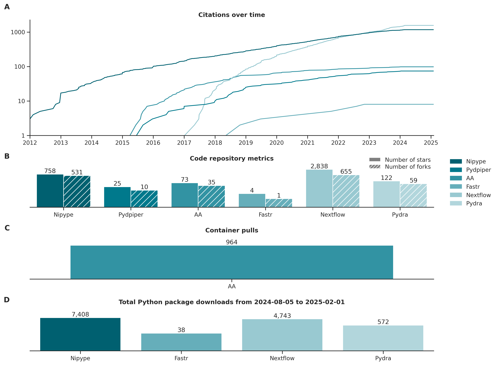

# analytical-flexibility-tool-metrics

Metrics for tools described in analytical flexibility review paper

- [analytical-flexibility-tool-metrics](#analytical-flexibility-tool-metrics)
  - [Installation](#installation)
  - [Usage](#usage)
    - [Example calls](#example-calls)
      - [Update figures used in review paper](#update-figures-used-in-review-paper)
      - [Regenerate figures without recomputing the metrics](#regenerate-figures-without-recomputing-the-metrics)
      - [Specify custom input file and output figures directory](#specify-custom-input-file-and-output-figures-directory)
  - [Data format](#data-format)
  - [Output](#output)

## Installation

Clone this repository: 
```bash
git clone https://github.com/neurodatascience/analytical-flexibility-tool-metrics.git
```

Move to the newly created directory:
```
cd analytical-flexibility-tool-metrics
```

One of the Python packages (`condastats`) needs to be installed using `conda` (there is a version on PyPI but the installation did not work). Hence, running the code requires creating a `conda` environment. Please refer to the official instructions on how to install [Anaconda](https://docs.anaconda.com/free/anaconda/install/index.html) or [Miniconda](https://docs.conda.io/projects/miniconda/en/latest/miniconda-install.html) for your operating system.

Once `conda` is installed, the next step is to create a new `conda` environment with the appropriate Python version. Here we call the environment `metrics`, but it can be any name. The code runs with Python 3.11.6. It might run with other versions but has not been tested.
```bash
conda create --name metrics python=3.11.6
```

Activate the environment:
```bash
conda activate metrics
```

Then, the `condastats` package can be installed with:
```bash
conda install -c conda-forge condastats
```

Finally, the other dependencies can be installed via `pip`. Assuming we are still in the `analytical-flexibility-tool-metrics` directory, the command is:
```bash
pip install -r requirements.txt
```

The latest versions of the required packages will most likely work. The exception is `pandas`, because some `condastats` functions crash with `pandas` later than 2.0.0. In case something does not work, the exact versions used when developing the code are:
* `condastats` 0.2.1
* `matplotlib` 3.8.2
* `pandas` 1.5.3
* `pypistats` 1.5.0
* `python-dotenv` 1.0.0
* `requests` 2.31.0
* `seaborn` 0.13.0

## Usage

The main script is `code/generate_figures.py`:
```
usage: generate_figures.py [-h] [--tools FPATH_TOOLS] [--figs-dir DPATH_FIGS]
                           [--load-metrics METRICS_CSV_IN]
                           [--save-metrics METRICS_CSV_OUT] [--overwrite]

options:
  -h, --help            show this help message and exit
  --tools FPATH_TOOLS   path to CSV file containing information about tools
                        (default: <PATH_TO_REPO>/data/tools.csv)
  --figs-dir DPATH_FIGS
                        path to output figures directory (default:
                        <PATH_TO_REPO>/figs)
  --load-metrics METRICS_CSV_IN
                        path to read metrics CSV file (optional). Note: --load-
                        metrics and --save-metrics cannot both be specified. Also,
                        if --load-metrics is specified, --tools is ignored
  --save-metrics METRICS_CSV_OUT
                        path to write metrics CSV file (optional). Note: --load-
                        metrics and --save-metrics cannot both be specified
  --overwrite           overwrite existing figures (and metrics file if applicable)
  ```

### Example calls

*All examples assume the working directory is the root directory of this repo.*

#### Update figures used in review paper
```bash
./code/generate_figures.py --overwrite
```

#### Regenerate figures without recomputing the metrics
```bash
./code/generate_figures.py --load-metrics data/metrics.csv --overwrite
```

#### Specify custom input file and output figures directory
```bash
./code/generate_figures.py --tools <PATH_TO_TOOLS_FILE> --figs-dir <PATH_TO_FIGS_DIR>
```

## Data format

See `data/tools.csv` for an example input file.

* `tool_name`: Name of the tool as it it appear in the figures.
* `review_paper_section`: Used to group tools into separate figures and to determine the name of the saved image file.
* `doi`: [Digital Object Identifier](https://www.doi.org/), such that `https://www.doi.org/{doi}` will resolve.
* `github`: GitHub repository owner and name (e.g., `neurodatascience/analytical-flexibility-tool-metrics`).
* `gitlab`: GitLab project ID, which can be found in the raw HTML source for the project's GitLab page (look for something like `project-id`/`data-project-id`).
    * See [here](https://stackoverflow.com/a/45500237) (might be outdated).
* `docker1`: Container image name on DockerHub.
* `docker2`: Same as `docker1`, for tools with container images published in two different places (e.g., because they were moved).
* `github_container`: Package name for GitHub container registry.
    * **Note**: It seems there is no GitHub API that provides this information, so this is currently not implemented.
* `pypi`: Package name for Python packages distributed through Pypi.
* `conda`: Package name for Python packages distributed through a `conda` channel.

## Output

The script generates figures (by default in a `figs` directory) with panels for each of the computed metrics (or metric groups). Here is an example of a complete figure:



The metrics used in each panel are:
1. **Citations over time**: Cumulative number of citations obtained from https://opencitations.net/
    * Column(s) used: `doi`.
2. **Code repository metrics**: Number of stars and forks obtained from the GitHub and/or GitLab APIs.
    * Column(s) used: `github`, `gitlab`
3. **Container pulls**: Number of container downloads obtained from the DockerHub API.
    * Column(s) used: `docker1`, `docker2`
4. **Python package downloads in the last 180 days**: Number of downloads from Pypi (obtained using [`pypistats`](https://pypistats.org/)) and/or `conda` (obtained using [`condastats`](https://condastats.readthedocs.io/en/latest/)).
    * Column(s) used: `pypi`, `conda`
